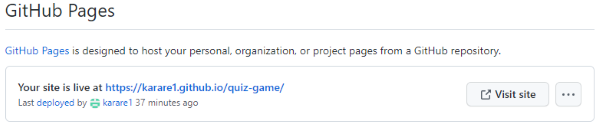

# COOL QUIZ 

The COOL Quiz was created for anyone who wants to test their knowledge or learn some new interesting facts about the winter season. The players can take the quiz on their own or it can be used as a family indoor activity for those cold and dark evenings. The quiz has 12 multiple choice questions with a 120-second timer and a Top Score page so the players can save their best score. It hopes to engage all age groups or individuals of various interests, not just 'winter fans'.

## User Experience (UX)

### User Stories 

- As a user, I would like to understand the purpose of the website and what is being tested by the quiz before I start.
- As a user, I would like to have the option to read the instructions, so that I can understand how to play the game.
- As a user, I would like to play the quiz and see the content clearly on any device.
- As a user, I would like to be able to easily navigate through the website to complete the quiz.
- As a user, I would like to see if the answer I have chosen is correct or incorrect before proceeding to the next question.
- As a user, I would like to see my progress during the quiz (question counter, time counter and score counter).
- As a user, I would like to see my final score, have an option to save my best score and play again.

### Implementation 

- Used a layout with a winter background image, winter colours and picked an appropriate quiz title as well as a catchy initial        
  message to give users an early sense of what the quiz is about.
- Created a pop-up window to introduce the game to the users and to familiarize them with the quiz rules.
- Made the quiz responsive, visible and easy to read on desktops, laptops, tablets and smartphones.
- Created a simple intuitive design for easy navigation and used links for a smooth transport between pages.
- Made the quiz interactive as the chosen answers will turn green if correct or red if incorrect.
- Added Question counter, Time counter and Score counter to the game page.
- Added a result page that displays the quiz results as well as gives an option to save the users' scores.

## Features 

Cool Quiz consists of four webpages that all have an intuitive design for easy navigation.

  - ### Home Page
  This page introduces the quiz and shows important links to the game itself and to the Top Score page.
  - ### Game Page
  This is the core page of the quiz; it displays questions and multiple answer options as well as a navigation bar displaying the progress of the game.
  - ### Result Page
  It shows the results of the quiz and enables the player to save their score if they wish to do so.
  - ### Top Score Page
  Displays a list of top 7 scores.

### Existing Features

- __Home Page__

- The home page is the screen the end user is presented with on page load.  
  All four webpages have the same winter themed background image and colours, with a silver background for the website content. The 
  aim is to create a wintry atmosphere for players and bring back some memories of exciting winter events and activities.
  
- _Header_
  - The header has the same colour design as all other pages to support the intuitiveness of the entire website. The name of the
    quiz was chosen in order to give the visitors a hint of what the quiz is about. This intuitive layout enhances the user experience and makes the website easy to use.

- _Body_
  - The body includes an encouraging message to challenge the visitors to click on the START button and play the game.
  - The skeleton of the body has three buttons:
  - ABOUT button - clicking on the ABOUT button will display a pop-up box with the game rules. It includes all information the player 
    needs to know before starting the game.
  - START button is placed in the middle and has a different colour to underlay its importance. Clicking on this button will redirect 
    the player to the game page where they can start the quiz.
  - TOP SCORE button will forward the visitors to the list of the 7 best results.
  - Overall, the body layout is simple to understand and easy to navigate for the user.
  
- _Footer_
  - Similarly to the header, the footer remains the same regardless of the webpage. It contains a name of the production company and 
    the year of production. This intuitive layout contributes to the user experience.
      
    

      
    

      
    

      
    

__Game Page__
- _Header_
  - The header includes the navigation bar which consists of the link to the home page and three other elements to monitor the  
    progress of the quiz. The player can click on the home icon anytime during the game to take them back to the home page and start the game again. Placing the home icon on this page allows users to navigate easily between pages and to return to the home page if they wish without having to use the back button.  
    The progress elements are all dynamic and are being updated with each question asked. 
  - Elements to monitor the progress:
    - Question counter shows how many questions have been answered so far as well as the total number of questions.
    - Time counter shows how many seconds are still left to complete the quiz. There is a 120 seconds countdown timer and if a player  
      runs out of time before completing the quiz, they will be redirected back to the home page to have another go.
    - Score counter shows how many points a player has received so far for all correctly answered questions. For each correct answer, 
      a player will get 100 points (1200 points maximum). 
    This ability to monitor the progress during the quiz enhances the user experience and also the motivation to achieve the highest score.
 
- _Body_  
  - The body shows the current question with four answer options. Clicking on one of these four options will deactivate the remaining 
    three and reveal if the chosen option is correct or not. The player will then be forwarded to the next question. Once a player clicks on an option, it cannot be changed. This will enhance the fluidity and energy of the game and encourage players to complete the quiz on time.  
    The time counter will prompt the user to answer questions correctly but also within a short period of time. This presents a double challenge and it makes the game more interesting and appealing to users. If the user does not answer all 12 questions in the allocated time, the quiz will automatically finish and they will be taken back to the home page. This will encourage users to take the quiz again.  
    Furthermore, if a player answers the question incorrectly, the correct answer will not be revealed. This should make the game more attractive as it will encourage the user to try again and improve their score. Once all questions have been answered, a player will automatically be directed to the result page.
- _Footer_ (please see the section about Footer above) 
     
   

     
   
    

__Result Page__
  - It shows how many points a player has scored in the quiz and gives them an option to save their score. To do so, a player has to 
    insert a username containing only alphabetic characters, without any numbers, special characters or spaces.
  - If the username meets the criteria, clicking on the SAVE button will save the player's score and return the player to the home 
    page. If the user does not want to save their score, they have an option to click on Go Home button which takes them back to the home page or on Play Again button to get to the game page and start playing again.
      
    

      
    
    

__Top Score Page__
  - This page displays a list of the 7 highest scores. 
    It also has the home icon for better navigation and it takes the user back to the home page.
      
    

      
    
    

### Features Left to Implement

  - Optaining more questions from the API open database to offer users a greater variety of questions and to make the quiz more 
    attractive
  - I would like to incorporate difficulty levels (easy, medium, hard)
  - Adding audio effects to a quiz question

### Wireframes 
- [Home Desktop](assets/wireframes/Home%20Desktop.png)
- [Home Tablet](assets/wireframes/Home%20Tablet.png)
- [Home Mobile](assets/wireframes/Home%20Phone.png)
- [Game Desktop](assets/wireframes/Game%20Desktop.png)
- [Game Tablet](assets/wireframes/Game%20Tablet.png)
- [Game Mobile](assets/wireframes/Game%20Phone.png)
- [Result Desktop](assets/wireframes/Result%20Desktop.png)
- [Result Tablet](assets/wireframes/Result%20Tablet.png)
- [Result Mobile](assets/wireframes/Result%20Phone.png)
- [Top Score Desktop](assets/wireframes/Top%20Score%20Desktop.png)
- [Top Score Tablet](assets/wireframes/Top%20Score%20Tablet.png)  
- [Top Score Mobile](assets/wireframes/Top%20Score%20Phone.png)

## Testing 

Manual Testing of implemented features:   

 - HOME PAGE Testing

| **Feature** | **Action** | **Expected Result** | **Actual Result** |
|-------------|------------|---------------------|-------------------|
| ABOUT button  | Click the button | A pop-up box opens with introduction and game rules | Works as expected |
| START button  | Click the button| Player is directed to the game page and can start playing | Works as expected |
| TOP SCORE button | Click the button| This takes the player to the top-score page to check the leaderboard	| Works as expected |
 
   

- GAME PAGE Testing

| **Feature** | **Action** | **Expected Result** | **Actual Result** |
|-------------|------------|---------------------|-------------------|
| HOME button  | Click the button | Take a player to the home page anytime during the game | Works as expected |
| QUESTION counter  | Automatic feature| Shows what question the player is currently on, onwards counting | Works as expected |
| TIMER  | Automatic feature | Starts counting down automatically when the quiz appears on the screen | Works as expected |
| TIMER  | Automatic feature | For the last ten seconds the time text changes to red | Works as expected |
| TIMER  | Automatic feature | When time is up before answering all questions, the player is returned to the home page | Works as expected |
| SCORE counter | Click on the correct answer | Clicking on the correct answer will increase the score by 100 points| Works as expected |
| SCORE counter|  Click on the incorrect answer|  Clicking on the incorrect answer will not change the score| Works as expected |
| ANSWERS options  | Click on one of the 4 answers-options | Clicking on an option will disable the remaining three options | Works as expected |
| ANSWERS options  | Click on one of 4 answer options | The clicked option will change to green if correct and the score will be updated | Works as expected |
| ANSWERS options  | Click on one of 4 answer options | The clicked option will change to red if incorrect and the score will remain unchanged | Works as expected |
| Next question  | Automatic feature | Clicking on an answer option will evaluate the correctness and after 2 seconds a new question will appear| Works as expected |
| Last question | Automatic feature | Clicking on the last answer option will evaluate the correctness and then forward the player to the result page |  Works as expected |

  

- RESULT PAGE Testing

| **Feature** | **Action** | **Expected Result** | **Actual Result** |
|-------------|------------|---------------------|-------------------|
| Result  | Automatic feature | The correct score will appear on the result page | Works as expected |
| USERNAME  | Enter name | Only text of min 3 and max 10 letters is excepted, no numbers or spaces | Works as expected |
| SAVE button  | Click the button| Saves the players’ score and takes them back to the home page | Works as expected |
| SAVE button  | Click the button| Input validation – do not save the score if the entered username does not meet the relevant criteria | Works as expected |
| GO HOME button  | Click the button | Takes players back to the home page if they do not want to save the score | Works as expected |
| PLAY AGAIN buton  | Click the button | Takes players to the game page where they can start the quiz again without saving their score | Works as expected |

  

- TOP SCORE PAGE Testing

| **Feature** | **Action** | **Expected Result** | **Actual Result** |
|-------------|------------|---------------------|-------------------|
| Saved result | click on TOP SCORE button | Correct score displayed against a correctly saved name | Works as expected |
| 7 best scores | click on TOP SCORE button | Score appears on this page only if it is within the 7 best results | Works as expected |
| HOME buton  | Click the button | Takes the player back to the home page | Works as expected |

  

### Validator Testing 

- HTML
  The W3C Validator has been used to validate the HTML of the website.  
  All errors have been corrected.  
  [W3C validator](https://validator.w3.org/nu/?doc=https%3A%2F%2Fkarare1.github.io%2Fquiz-game%2F)

- CSS
  The W3C Jigsaw Validator was used to validate the CSS of the website.  
  All errors have been corrected.  
  [(Jigsaw) validator](https://jigsaw.w3.org/css-validator/validator?uri=https%3A%2F%2Fkarare1.github.io%2Fwhite-lines%2F&profile=css3svg&usermedium=all&warning=1&vextwarning=&lang=en)

- JSHint Services were used to validate Javascript  
  All errors syntax errors corrected  
  [script.js](assets/js-validation/js-validator-script.png)  
  [game.js](assets/js-validation/js-validator-game.png)  
  [result.js](assets/js-validation/js-validator-result.png)  
  [topscore.js](assets/js-validation/js-validator-topscore.png)  

- The WAVE Web Accessibility Evaluation Tool was used to check accessibility of the website:  
  [Wave Web report](assets/lighthouse/wave-evaluation.png)

- Lighthouse reports:   
  [Lighthouse report Index](assets/lighthouse/lighthouse-report-index.png)  
  [Lighthouse report Game](assets/lighthouse/lighthouse-report-game.png)  
  [Lighthouse report Result](assets/lighthouse/lighthouse-report-result.png)  
  [Lighthouse report Score](assets/lighthouse/lighthouse-report-score.png)  

- Further testing has been done with Chrome DevTools, making sure that responsiveness works correctly on all devices.
  After the deployment, I tested the website link focusing on the game and result page to check if all important features work as expected. No issues were detected. 

- The website was assessed in various browsers: Mozilla Firefox, Google Chrome and Microsoft Edge.
  Live link was tested on Huawei P30, Samsung A50 to test smaller screen sizes, on a small display laptop - HP ProBook 430 and also on a larger display laptop - Dell Latitude 5580.  
  Each of the pages functioned well.

### Unfixed Bugs
None I am aware of. 

## Deployment

Deployment To GitHub Pages:   

1. Create a repository in GitHub   
    

2. Create the entry file for a site. GitHub Pages will look for an index.html as the entry file for the site   

3. Git push all contents from Integrated Development Environment (IDE) into GitHub  

4. On GitHub page, click on the site's repository on the left sidebar or alternatively click on the avatar icon and 
   then 'Your repositories'   
    &nbsp; &nbsp; &nbsp; &nbsp;   

5. In the repository, under the repository name (e.g. karare1/white-lines), click Settings    
    

6. In the "Code and automation" section on the left sidebar, click on Pages    
    

7. From the source section drop-down menu, select 'Deploy from a Branch'   
   From the branch section drop-down menu, select 'main' and 'root' and then click on Save button    
     

8. The link to the site will be automatically created.  
   To see the published site, under "GitHub Pages", click the site's URL    
    

   The live link can be found here: https://karare1.github.io/quiz-game/  

## Technologies Used 
- [HTML](https://en.wikipedia.org/wiki/HTML)
- [CSS](https://en.wikipedia.org/wiki/CSS)
- [Javascript](https://en.wikipedia.org/wiki/JavaScript)

Also made use of:
- [Font Awesome](https://fontawesome.com/)
- [favicon.io](https://favicon.io/favicon-generator/)
- [HTML Validator](https://validator.w3.org/)
- [CSS Validator](https://jigsaw.w3.org/css-validator/)
- [Javascript Validator](https://jshint.com/)
- [Chrome DevTools](https://developer.chrome.com/docs/devtools/open/)
- [Balsamiq](https://en.wikipedia.org/wiki/Balsamiq)

## Credits 
- [www.scrimba.com.com](https://scrimba.com/learn/learnjavascript)   
- [www.nikitahl.com.com](https://nikitahl.com/convert-array-like-collections-to-array/)   
- [www.www.classcentral.com](https://www.classcentral.com/course/youtube-build-a-quiz-app-with-html-css-and-javascript-45707/classroom)  
- [www.freecodecamp.org](https://www.freecodecamp.org/news/javascript-projects-for-beginners/)   
- [www.developer.mozilla.org](https://developer.mozilla.org/en-US/docs/Web/API/Window/localStorage)   
- [www.w3schools](https://www.w3schools.com/)   

### Content 

- The text for the Home page was taken from:   
  [www.ultimatequizquestions.com](https://www.ultimatequizquestions.com/winter-trivia-questions/)   
  [www.quiztriviagames.com](https://www.quiztriviagames.com/winter-quiz/)   
  [www.wordsforlife.org.uk](https://wordsforlife.org.uk/activities/take-a-quiz-about-winter-celebrations/)   

### Media

- Background image:   
  [winter.jpg](https://www.pexels.com/photo/aurora-borealis-624015/)   
  Photo by Frans van Heerden downloaded from Pexels
- Icons were taken from [Font Awesome](https://fontawesome.com/)

