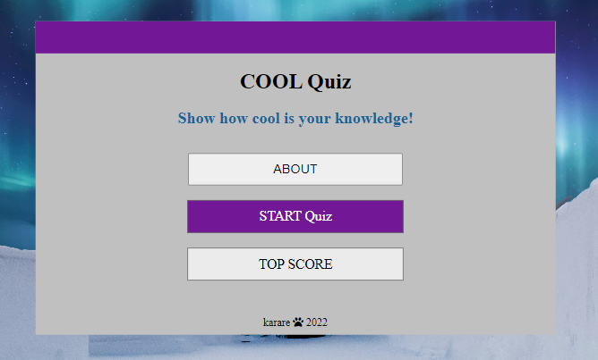

# COOL QUIZ 

The COOL Quiz was created for anyone who wants to test their knowledge or learns some new interesting facts about the winter season. The player can take the quiz yourself or it can be used as a family indoor activity for those cold and dark evenings.
The quiz has 12 multiple choice questions with a 120-second timer and a High Score page so the player can save their best score.
It hopes to engage all age groups or individuals of various interests not just a 'winter fans'. 

## User Experience (UX)
- As a user, I would like to understand the purpose of the website and what is being tested by the quiz before I start.
- As a user, I would like to read instructions, so that I can understand how to play the game.
- As a user, I would like to play the quiz and see content clearly on any device.
- As a user, I would like to be able to easily navigate through the website to complete the quiz.
- As a user, I would like to see if the answer I have chosen is correct or incorrect before proceeding to the next question.
- As a user, I would like to see my progress during the quiz (to see question counter, time counter and Score counter).
- As a user, I would like to see my final score, have an option to save my best score and play again.

Implementation: 
- Used the layout with a winter background image, winter colours as well as an appropriate title of the quiz and its initial message 
  to give users an early sense of what the quiz is about.
- Created pop-up window to introduce the game and present a user with the quiz rules.
- Made the quiz responsive, visible and easy to read on desktops, laptops, tablets and smartphones.
- Created a simple intuitive design for easy navigation and using links for a smooth transport between pages
- Made the quiz interactive by changing a chosen answer-option green if correct and red if incorrect. 
- Added Question counter, Time counter and Score counter to the game page.
- Added a result page that display the quiz result as well as option to save the users' score.

## Features 

Cool Quiz consists of four webpages that all have an intuitive design for easy navigation.

  - ### Home Page
  This page gives an introduction to the quiz and important links to the game itself and to the top score page.  
  - ### Game Page
  This is the core page of the quiz; it displays questions and answers-options as well as a navigation bar to see progress of the game.
  - ### Result Page
  It shows the result of the quiz and includes the possibility for the player to save their score. 
  - ### Top Score Page
  It displays a list of 7 best scores.

### Existing Features

- __Home Page__
- The home page is the screen the end user is presented with on page load.
- All four webpages have the same winter themed background image and colours with silver background for the website content. 
  The aim is to create a wintery atmosphere for players and bring back some memories of exciting winter events and activities.   
  - _Header_
    - Header has the same colour design as other pages to support intuitiveness of the entire website and the name of the quiz to give   
      a visitor a hit what the quiz is about. This intuitive layout enhances the user experience and make the website easy to use. 
  - _Body_
    - Body includes an encouraging message to challenge the visitor to click on the START button and play the game. 
    - The skeleton of the body has three buttons:  
      - ABOUT button - clicking on the ABOUT button will display a pop-up box with the game rules. It includes all information the player needs to know before they start the game.
      - START button is placed in the middle and have a different colour to underlay its importance. Clicking on this button will redirect the player to the game page where they can start the quiz. 
      - TOP SCORE button will forward the visitor to the list of 7 best results. 
    - Overall, the body layout is simple and easy to understand and navigate the user. 
  - _Footer_
    - Similarly to the header, the footer remains the same regardless of the webpage. 
      It contains a name of the production company and a year of production.
      This intuitive layout contributes to the users experience.
      
    

      
    

__Game Page__
- _Header_
    - Header includes the navigation bar which consists of the link to a home page and other three elements to monitor the progress of 
      the quiz. The player can click on the home icon anytime during the game to take them back to the home page a start the game again. Placing the home icon on this page allows users easily navigate between pages and to return to the home page if they wish without having to use the back button.
      The progress elements are all dynamic and update with each question asked.
      Elements to monitor the progress:
       - Question counter shows a player how many questions have been answered so far as well as the total number of questions. 
       - Time counter shows how many seconds are still left to complete the quiz. It is 120 seconds countdown timer and if a player 
         runs out of time before completing the quiz, they will be redirected back to the home page to have another go. 
       - Score counter shows how many points a player has being received if answered a question correctly. For each correct answer a 
         player can get 100 points (1200 points maximum).
      Ability to monitor the progress during the quiz enhance the user experience and their motivation to achieve the highest score. 
- _Body_  
    - Body shows a current question with four answers-options. Clicking on the one of these four options will deactivate the rest 
      three options and reveal if the chosen option is correct or not. The player will then be forwarded to the next question. Once a player clicked on an option it cannot be rechanged. This will enhance the fluidity and energy of the game and encourage a player to complete the quiz on time. 
      Time counter will prompt the user to answer questions correctly but also within a short period of time. It means double challenge and it makes the game more interesting and appealing to users.
      If the user does not answer all 12 questions in the allocated time the quiz will automatically finish and they will be taken back to the home page. This will encourage users to take the quiz again. Also, if a player answers the question incorrectly, the correct answer will not be revealed which makes the game more attractive encourage a user to play again and improve their score. 
      Once all questions have been answered, a player is automatically directed to the result page. 
- _Footer_ (please see the section about Footer above)   
      
    

      
    
    

__Result Page__
  - It shows how many points a player scored in a quiz and the option to save the score. 
    For saving the score a player has to insert a username that can contain only alphabets without any numbers, special characters or spaces. 
  - If the username meets the criteria, clicking on the SAVE button will save the player's score and return a player to the home page. 
    If the user does not want to save their score, they have an option to click on Go Home button to take them to the home page or Play Again button to get to the game page and start playing again. 
    
  

    
  
    

__Top Score Page__
  - This page displays a list of the 7 best scores. 
    It also has the home icon for better navigation and it takes a user back to the home page.
      
    

      
    
    

### Features Left to Implement

  - get questions from API open database to offer users a greater variety of questions and to make the quiz more attractive 
  - I would like to incorporate difficulty levels (easy, medium, hard)
  - add audio effects to a quiz question

### Wireframes 
- [Home Desktop](assets/wireframes/Home%20Desktop.png)
- [Home Tablet](assets/wireframes/Home%20Tablet.png)
- [Home Mobile](assets/wireframes/Home%20Phone.png)
- [Game Desktop](assets/wireframes/Game%20Desktop.png)
- [Game Tablet](assets/wireframes/Game%20Tablet.png)
- [Game Mobile](assets/wireframes/Game%20Phone.png)
- [Result Desktop](assets/wireframes/Result%20Desktop.png)
- [Result Tablet](assets/wireframes/Result%20Tablet.png)
- [Result Mobile](assets/wireframes/Result%20Phone.png)
- [Top Score Desktop](assets/wireframes/Top%20Score%20Desktop.png)
- [Top Score Tablet](assets/wireframes/Top%20Score%20Tablet.png)  
- [Top Score Mobile](assets/wireframes/Top%20Score%20Phone.png)

## Testing 

Manual Testing of implemented features:   

 - HOME PAGE Testing

| **Feature** | **Action** | **Expected Result** | **Actual Result** |
|-------------|------------|---------------------|-------------------|
| ABOUT button  | Click the button | Open a pop-up box with introduction and the game rules | Works as expected |
| START button  | Click the button| Player is forwarded to the game page and can start playing | Works as expected |
| TOP SCORE button  | Click the button| It will take the player to the top-score page to check the leaderboard | Works as expected |
 
   

- GAME PAGE Testing

| **Feature** | **Action** | **Expected Result** | **Actual Result** |
|-------------|------------|---------------------|-------------------|
| HOME button  | Click the button | Take a player to the home page anytime during the game | Works as expected |
| QUESTION counter  | Automatic feature| Show what question is the player currently on, onwards counting | Works as expected |
| TIMER  | Automatic feature | Start counting down automatically when the quiz appears on the screen | Works as expected |
| TIMER  | Automatic feature | For the last ten seconds the time text will change to red | Works as expected |
| TIMER  | Automatic feature | When time is up before answering all questions, a player will return to the home page | Works as expected |
| SCORE counter | Click on the correct answer | Clicking on the correct answer will increase the score by 100 points| Works as expected |
| SCORE counter|  Click on the incorrect answer|  Clicking on the incorrect answer will not change the score| Works as expected |
| ANSWERS options  | Click on a one of 4 answers-options | Clicking on an option will disable the remaining three options | Works as expected |
| ANSWERS options  | Click on a one of 4 answers-options | The clicked option will change to green if correct and score will update | Works as expected |
| ANSWERS options  | Click on a one of 4 answers-options | The clicked option-button will change to red if incorrect and score will remain unchanged | Works as expected |
| Next question  | Automatic feature | Clicking on an answer-option will evaluate the correctness and after 2 seconds a new question will be retrieved|  Works as expected |
| Last question  | Automatic feature | Clicking on the last answer-option will evaluate the correctness and then forward the player to the result page|  Works as expected |

  

- RESULT PAGE Testing

| **Feature** | **Action** | **Expected Result** | **Actual Result** |
|-------------|------------|---------------------|-------------------|
| Result  | Automatic feature | Correct score will appear on the result page | Works as expected |
| USERNAME  | Enter name | Only text of min 3 and max 10 alphabets is excepted, no numbers or spaces  | Works as expected |
| SAVE button  | Click the button| Saving the player's score and take them back to the home page | Works as expected |
| SAVE button  | Click the button| Input validation - not saving the score if the entered username does not meet the relevant criteria  | Works as expected |
| GO HOME button  | Click the button | Take a player to the home page if they do not want to save the score | Works as expected |
| PLAY AGAIN buton  | Click the button | Take a player to the game page and they can start the quiz again without saving their score | Works as expected |

  

- TOP SCORE PAGE Testing

| **Feature** | **Action** | **Expected Result** | **Actual Result** |
|-------------|------------|---------------------|-------------------|
| Saved result | click on TOP SCORE button | Correct score against correct name saved | Works as expected |
| 7 best scores | click on TOP SCORE button | Score appeared on the page only if it is within 7 best results  | Works as expected |
| HOME buton  | Click the button | Take a player back to the home page  | Works as expected |

  

### Validator Testing 

- HTML
  - No errors were returned when passing through the official [W3C validator](https://validator.w3.org/nu/?doc=https%3A%2F%2Fkarare1.github.io%2Fwhite-lines%2F)
- CSS
  - Two syntax errors were found when passing through the official Jigsaw validator - a comma used instead of a semi-colon and font:size instead of font-size - both errors have been corrected. [(Jigsaw) validator](https://jigsaw.w3.org/css-validator/validator?uri=https%3A%2F%2Fkarare1.github.io%2Fwhite-lines%2F&profile=css3svg&usermedium=all&warning=1&vextwarning=&lang=en)

- Lighthouse report:   
  

- Further testing has been done with Chrome DevTools, making sure that responsiveness works correctly on all devices. 
  After the deployment, I tested the website link focusing on the game and result page to check if all important features work as expected. No issues were detected. 

- The website was assessed in various browsers: Mozilla Firefox, Google Chrome and Microsoft Edge.
  Live link was tested on Huawei P30, Samsung A50 to test smaller screen sizes, on a small display laptop - HP ProBook 430 and also on a larger display laptop - Dell Latitude 5580. 
  Each of the pages functioned well.

### Unfixed Bugs
None I am aware of. 

## Deployment

Deployment To GitHub Pages:   

1. Create a repository in GitHub   
    

2. Create the entry file for a site. GitHub Pages will look for an index.html as the entry file for the site   

3. Git push all contents from Integrated Development Environment (IDE) into GitHub  

4. On GitHub page, click on the site's repository on the left sidebar or alternatively click on the avatar icon and 
   then 'Your repositories'   
    &nbsp; &nbsp; &nbsp; &nbsp;   

5. In the repository, under the repository name (e.g. karare1/white-lines), click Settings    
    

6. In the "Code and automation" section on the left sidebar, click on Pages    
    

7. From the source section drop-down menu, select 'Deploy from a Branch'   
   From the branch section drop-down menu, select 'main' and 'root' and then click on Save button    
     

8. The link to the site will be automatically created.  
   To see the published site, under "GitHub Pages", click the site's URL    
    

   The live link can be found here: https://karare1.github.io/quiz-game/  

## Technologies Used 
- [HTML](https://en.wikipedia.org/wiki/HTML)
- [CSS](https://en.wikipedia.org/wiki/CSS)
- [Javascript](https://en.wikipedia.org/wiki/JavaScript)

Also made use of:
- [Font Awesome](https://fontawesome.com/)
- [favicon.io](https://favicon.io/favicon-generator/)
- [HTML Validator](https://validator.w3.org/)
- [CSS Validator](https://jigsaw.w3.org/css-validator/)
- [Javascript Validator](https://jshint.com/)
- [Chrome DevTools](https://developer.chrome.com/docs/devtools/open/)
- [Balsamiq](https://en.wikipedia.org/wiki/Balsamiq)

## Credits 
- [www.scrimba.com.com](https://scrimba.com/learn/learnjavascript)   
- [www.nikitahl.com.com](https://nikitahl.com/convert-array-like-collections-to-array/)   
- [www.www.classcentral.com](https://www.classcentral.com/course/youtube-build-a-quiz-app-with-html-css-and-javascript-45707/classroom)   
- [www.freecodecamp.org](https://www.freecodecamp.org/news/javascript-projects-for-beginners/)   
- [www.developer.mozilla.org](https://developer.mozilla.org/en-US/docs/Web/API/Window/localStorage)   
- [www.w3schools](https://www.w3schools.com/)   

### Content 

- The text for the Home page was taken from:   
  [www.ultimatequizquestions.com](https://www.ultimatequizquestions.com/winter-trivia-questions/)   
  [www.quiztriviagames.com](https://www.quiztriviagames.com/winter-quiz/)   
  [www.wordsforlife.org.uk](https://wordsforlife.org.uk/activities/take-a-quiz-about-winter-celebrations/)   

### Media

- Background image:   
  [winter.jpg](https://www.pexels.com/photo/aurora-borealis-624015/)   
  Photo by Frans van Heerden downloaded from Pexels
- Icons were taken from [Font Awesome](https://fontawesome.com/)

<!-- 
[www.helenricetennis.com.au](https://www.helenricetennis.com.au/)

- The icons in the footer were taken from [Font Awesome](https://fontawesome.com/)
- Grandslam pictures:  
  Australian Open, Roland Garros and Wimbledon pictures were taken from Wikipedia.   
  US open picture from:
  [US Open logo](https://www.google.com/url?sa=i&url=https%3A%2F%2Fencrypted-tbn0.gstatic.com%2Fimages%3Fq%3Dtbn%3AANd9GcS4hwD1lwf3fYFSyZU9IDJSRd8JOKlkpOEIyesDMqHKvmbFvKRb&psig=AOvVaw0jLHDk55VwAtAsXAEVLB2_&ust=1665698857999000&source=images&cd=vfe&ved=0CAkQjhxqFwoTCNCyr_fZ2_oCFQAAAAAdAAAAABAD)

- Logo1 and Logo2 created on:  [www.smashinglogo.com](https://smashinglogo.com/en/)

- Video used on the Home Page: [Video](https://pixabay.com/videos/tennis-court-tennis-sports-overhead-35265/)  
  Video by VReel.co Stock Drone Video Platform from Pixabay 

  Photo by Cristina Anne Costello on Unsplash   
  [img2.png](https://pixabay.com/vectors/tennis-racket-game-sports-net-304408/)  
  Image by Clker-Free-Vector-Images from Pixabay 
  (color changed using an image editor)   
  [img3.png](https://www.pexels.com/photo/boy-wearing-sportswear-standing-by-the-tennis-net-8223947/)   
  Photo by RODNAE Productions  
  [img4.png](https://www.pexels.com/photo/girl-playing-tennis-8224723/)   
  Photo by RODNAE Productions   
  [img5.png](https://www.pexels.com/photo/girl-wearing-sportswear-standing-by-the-tennis-net-8224498/)  
  Photo by RODNAE Productions   
  [img6.png](https://unsplash.com/photos/l3sIOhf9R3U)   
  Photo by Braden Egli on Unsplash  
  [img7.png](https://www.pexels.com/photo/woman-playing-tennis-on-court-2440324/)   
  Photo by Lukáš Dlutko   
  [img8.png](https://www.pexels.com/photo/tennis-player-holding-a-racket-10340627/)   
  Photo by cottonbro  
  background image:  
  [img9.png](https://pxhere.com/en/photo/1189774)  
  Photo by form PxHere

- Images used on the gallery page:   
  [tennis-gallery-1.png](https://unsplash.com/photos/Z4Sxy1_3wdY)   
  Photo by Julian Schiemann on Unsplash  
  [tennis-gallery-2.png](https://unsplash.com/photos/k_H7OSg_fUs)   
  Photo by Braden Egli on Unsplash   
  [tennis-gallery-3.png](https://unsplash.com/photos/oDlLU_1hZwM)  
  Photo by Richard Sagredo on Unsplash   
  [tennis-gallery-4.png](https://unsplash.com/photos/GQmYqY2ySLg)  
  Photo by Guzmán Barquín on Unsplash   
  [tennis-gallery-5.png](https://unsplash.com/photos/q9iVyHxn230)  
  Photo by 傅甬 华   
  [tennis-gallery-6.png](https://www.pexels.com/photo/girl-playing-tennis-8224672/)  
  Photo by RODNAE Productions  
  [tennis-gallery-7.png](https://www.pexels.com/photo/boy-playing-tennis-8224717/)  
  Photo by RODNAE Productions  
  [tennis-gallery-8.png](https://www.pexels.com/photo/girl-playing-tennis-8224683/)   
   Photo by RODNAE Productions   
  [tennis-gallery-9.png](https://www.pexels.com/photo/girl-playing-tennis-8224424/)   
  Photo by RODNAE Productions  
  [tennis-gallery-10.png](https://www.pexels.com/photo/sporty-female-playing-tennis-on-court-5409085/)   
  Photo by Mo Saeed   
  [tennis-gallery-11.png](https://www.pexels.com/photo/focused-tennis-player-hitting-ball-5067824/)   
  Photo by Anna Shvets   
  [tennis-gallery-12.png](https://www.pexels.com/photo/a-woman-in-black-top-and-white-skirt-playing-tennis-8652578/)   
  Photo by Dre Dawkcide

The website White Lines was developed with the goal of attracting people of all ages and tennis abilities in the Penarth and Cardiff areas to pick up a tennis racquet and join our academy. 
It hopes to engage parents to enroll their children in tennis lessons as well as adults who are just thinking of starting to play tennis as complete beginners or those who are looking for ways to improve their game.

This website will be helpful to aspiring tennis players in order to find out all the information on the academy: what the White Lines has to offer, what its culture is like, what tennis programmes are offered, and why they should sign up.

 - A logo links a user to the home page when clicked.
  - Navigation bar includes links to Home page, Gallery and Sign Up page. It is identical, positioned 
    at the top of each page, for easy navigation. 
    This intuitive layout enhances the user experience and gives users access to the information they want as quickly as possible.
    Placing the navigation bar at the top of each page allows users to navigate from page to page 
    without having to use the back button if they wish to return to the previous page.
      
    

      
    

    - A logo links a user to the home page when clicked.
  - Navigation bar includes links to Home page, Gallery and Sign Up page. It is identical, positioned 
    at the top of each page, for easy navigation. 
    This intuitive layout enhances the user experience and gives users access to the information they want as quickly as possible.
    Placing the navigation bar at the top of each page allows users to navigate from page to page 
    without having to use the back button if they wish to return to the previous page.
      
    

      
    

- __The landing video__
  - The landing includes a video from the tennis academy showing the site's tennis courts from a 
    bird's-eye perspective. 
    The purpose of this section is to capture the attention of users and let them discover the atmosphere of the place.
  - The overlay contains a welcome message with an encouraging slogan to appeal to the user and create a
     positive user experience.
      
    

      
    

     

- __About Academy__
  - The About Academy section presents the academy to the website visitor. It contains general
    information on who the academy is for, where the prospective customer can find the place and main objectives of the academy.
      
    

      
    

- __Offer section__
  - The offer section is an important part of the site. It shows what White Lines provide to tennis buffs and what 
    makes them better than their competitors. It is a selling part of the website and its goal is to convince prospective clients to register for courses by presenting the academy as a professional venue that has much to offer.
      
    

      
    

     

- __Tennis Programmes__ 
  - This section presents the tennis courses of the academy. It gives users an early sense of who are
    the programmes for and what they focuse on. It provides the user with the opportunity to specify which program is most suitable for them. Each program box has a 'Learn More' button that is supposed to bring visitors to the website where they can get more specific information about that particular program.
  - Below the tennis programs is the JOIN US TODAY button to encourage the user to purchase a tennis
    class. This link will bring the user to the Sign Up page to register for the Academy.
      
    

      
    

     

- __Testimonials__
  - The most important part of the website. The reason for this is testimonials give potential
    customers that one final push to sign up for the service. They are the most effective type of content to put on a website to get more sales.
  - The testimonials have been specifically designed to show the good side of the academy by saying 
    positive things on the tennis place, lessons and coaches. Great feedback from current or former customers will reassure those browsing the website that this is a great place to learn tennis skills.
      
    

      
    

     

- __Contact Details__
  - Contact Information Section - here users can find information about location, opening hours, e-mail
    address and telephone number. Contact details are easy to find; they are well structured and have a background colour to emphasize the importance of the section.
      
    

      
    

     

- __The Footer__
  - The footer area contains links to White Lines' social media sites. Links are opened in a new tab to
    make it easier to navigate. Social media integration gives users more ways to engage and interact with the academy. 
    They also create more opportunities to promote the service of the academy and build a larger customer base.
    Social media links are valuable for the user because they can obtain up-to-date information on academy activities, special events or various tennis practices.
  - Footer also includes links to major tennis slams. It allows tennis enthusiasts to follow the world's
    top tennis players and enhance their motivation.
    Similarly to the header, the footer remains the same regardless of the webpage a visitor browses. 
    This intuitive layout contributes to the users experience.
      
    

      
    

     

- __Gallery__
    - The gallery provides the user with supportive images of what life in the academy looks like. This section is
      designed to capture the attention of visitors and improve the user experience of the website. This section is valuable to users because they can identify the tennis experience they can gain and learn more about the tennis venue and its atmosphere.
      
    

      
    

     

- __The Sign Up Page__
  - This page will allow the user to get signed up to White Lines to begin their tennis journey. The user will 
    be able to create a White Lines Tennis academy account and specify the programme in which they are interested. The user will also be prompted to submit their full name, e-mail address and phone number.
      
    

      
    

      -->
